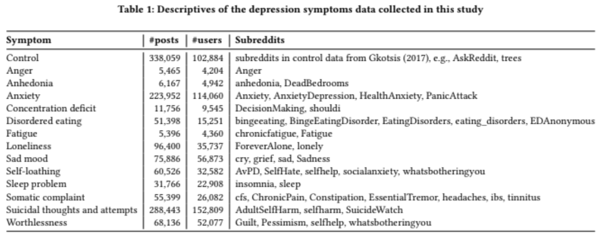

# Reddit Depression Detection

## Project Objective
The objective of this project is to train a random forest classifier to predict symptoms of depression from real Reddit text data. We use two methods to create linguistic features: fitting LDA and generating embeddings with (Distil)RoBERTa. To achieve this, we reimplement most parts of the paper [*Detecting Symptoms of Depression on Reddit*](https://dl.acm.org/doi/pdf/10.1145/3578503.3583621), including dataset generation and preprocessing.

## Dataset Generation
Due to memory limitations, we reduced the size of their dataset. You can access our reduced dataset [here](https://drive.google.com/file/d/1h03YG6H4lW-hwPgicSnfwtplUhxgN5WY/view?usp=sharing)

### control dataset
-  We create the control dataset by collecting non-mental health posts from same authors at least 180 days before their first post in a depression-related subreddit.
### symptom dataset
- For each symptom, we create a dataset by collecting posts from their respective subreddits, as shown in the table below.

## Preprocessing and Feature Extraction  

We used two methods to extract features:  

### 1. LDA (Latent Dirichlet Allocation)  
- **Tokenization**: The dataset was tokenized using the `happiestfuntokenizing` library.  
- **Stopword Removal**: The top 100 most frequent words were removed from the dataset to reduce noise.  
- **LDA Implementation**:  
  - The paper uses MALLET for LDA implementation.  
  - We opted for Gensim’s `LdaMulticore` model as it trains much faster than Scikit-learn’s implementation.  

### 2. DistilRoBERTa  
- **Tokenization**: The dataset was tokenized using RoBERTa's `AutoTokenizer`.  
- **Embedding Extraction**:  
  - The paper utilized the full RoBERTa model with 12 transformer blocks, extracting contextual embeddings from the 10th layer for downstream classification.  
  - For this project, we used DistilRoBERTa, a distilled version of RoBERTa with only 6 transformer blocks, enabling faster computation.  
  - We extracted embeddings from the 5th layer for downstream classification tasks.  

# Evaluation
We train 13 binary classifiers, each comparing a single symptom against control posts. Each symptom classifier is evaluated using:

- 5-fold cross-validation
- ROC-AUC scoring
- Balanced classes (equal samples from control and symptom)

Note: The original paper also evaluates symptom vs. control+other symptoms, which we omit.

## Ethical consideration

